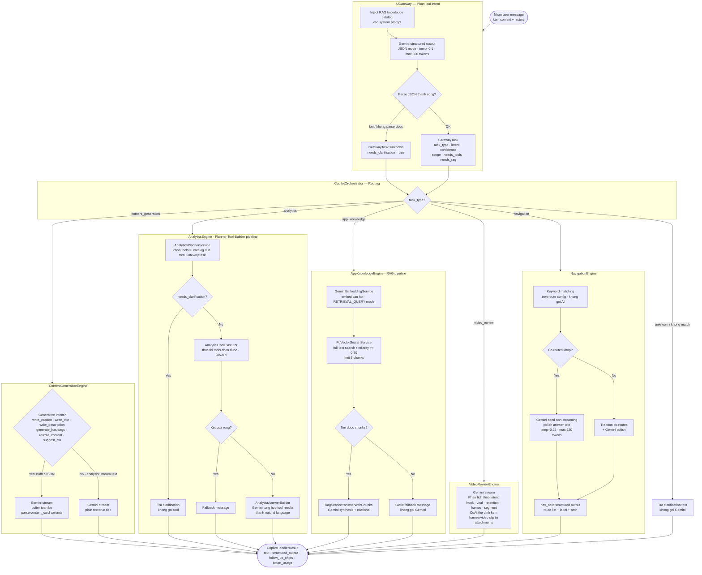

# SD-01b: AI Copilot — Engine Routing & Tool Dispatch

Mô tả luồng điều phối nội bộ của AI Copilot: từ khi nhận câu hỏi, qua Gateway phân loại intent, Orchestrator route sang đúng Engine, mỗi Engine gọi tool/AI theo cách riêng.

> Diagram này là chi tiết bên trong bước **Phase 1 & 2** của [SD-01](SD-01_AI_Copilot_SSE.md).

## Mô tả từng Engine

| Engine | Gọi Gemini | Streaming | Output đặc biệt |
|--------|-----------|-----------|-----------------|
| **ContentGenerationEngine** | `stream()` | Có (plain text) hoặc buffer JSON | `content_card` với variants cho generative intent |
| **AnalyticsEngine** | Không trực tiếp (AnswerBuilder gọi) | Không | `analytics_result` với tool_results |
| **AppKnowledgeEngine** | `stream()` qua RagService | Có (nếu RAG hit) | `citations` kèm nguồn tài liệu |
| **VideoReviewEngine** | `stream()` | Có | Plain text (hook/retention/viral analysis) |
| **NavigationEngine** | `send()` non-streaming | Không | `nav_card` với danh sách route |

## Ghi chú kiến trúc

- **AnalyticsEngine** là engine phức tạp nhất: 3 bước độc lập (Planner → Executor → Builder), tools được chọn từ catalog động — engine không hardcode tên tool.
- **AppKnowledgeEngine**: pgvector similarity search trước, chỉ gọi Gemini nếu tìm được chunks phù hợp (threshold 0.70). Không có chunks → trả static message, không tốn token.
- **NavigationEngine**: route matching hoàn toàn deterministic (keyword), Gemini chỉ được gọi để polish câu trả lời — đảm bảo route chính xác, không hallucinate.
- **GatewayTask::unknown** không dừng pipeline — Orchestrator xử lý bằng cách trả clarification text, không gọi Gemini lần thứ hai.
