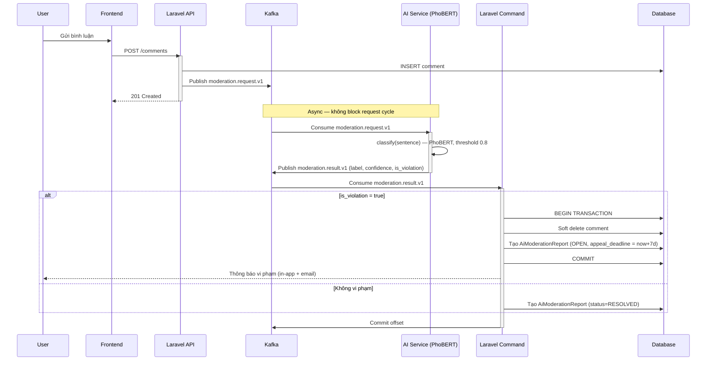

# SD-02: Content Moderation — Kiểm duyệt nội dung bất đồng bộ

Mô tả luồng kiểm duyệt bình luận bằng AI (PhoBERT) thông qua Kafka. Pipeline chạy hoàn toàn bất đồng bộ — Laravel API không bị block sau khi gửi message lên Kafka.

> Diagram này gộp SD-02a (tổng quan), SD-02b (PhoBERT inference), SD-02c (apply verdict) thành một luồng duy nhất, tập trung mô tả luồng chứ không mô tả chi tiết implementation.

## Ghi chú

- **Kafka topics**: `moderation.request.v1` (request) → `moderation.result.v1` (result).
- **`ModerationResultProcessorCommand`** là Laravel console command chạy độc lập, **không phải** HTTP API layer.
- **Threshold 0.8**: AI Service phân loại `is_violation = true` chỉ khi `label == 1 AND confidence >= 0.8`, giảm thiểu false positive.
- **Manual commit offset**: Command chỉ commit Kafka offset sau khi xử lý thành công, đảm bảo không mất message khi có lỗi.
- **DB transaction**: Đảm bảo tính nguyên tử giữa ẩn nội dung và tạo moderation report.
- **Appeal deadline**: Người dùng có 7 ngày kể từ khi bị ẩn để gửi kháng cáo.
