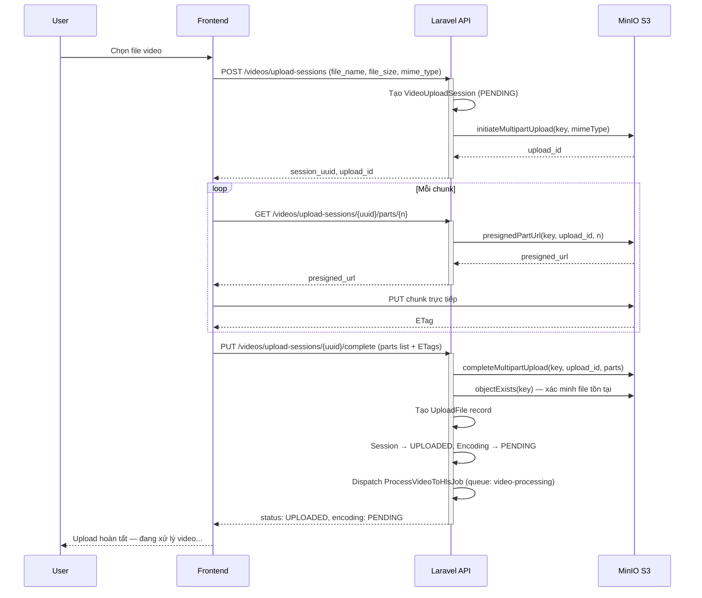

# SD-03a: Video Upload — Multipart Upload qua Presigned URL

Mô tả luồng người dùng tải video lên. Frontend upload chunk trực tiếp lên MinIO S3 qua presigned URL — Laravel API không xử lý data stream, chỉ cấp phát URL và quản lý metadata.

## Ghi chú

- **Chunk upload** đi trực tiếp **Frontend → MinIO**, không đi qua Laravel API. Laravel chỉ cấp presigned URL và quản lý metadata.
- **Session states**: `PENDING` → `UPLOADED` (khi complete thành công) → `ANALYZING` → `TRANSCODING` → `READY` (xem SD-03b).
- Sau khi dispatch job, session không chuyển sang `READY` ngay — trạng thái tiếp tục được cập nhật bởi queue worker (SD-03b).
