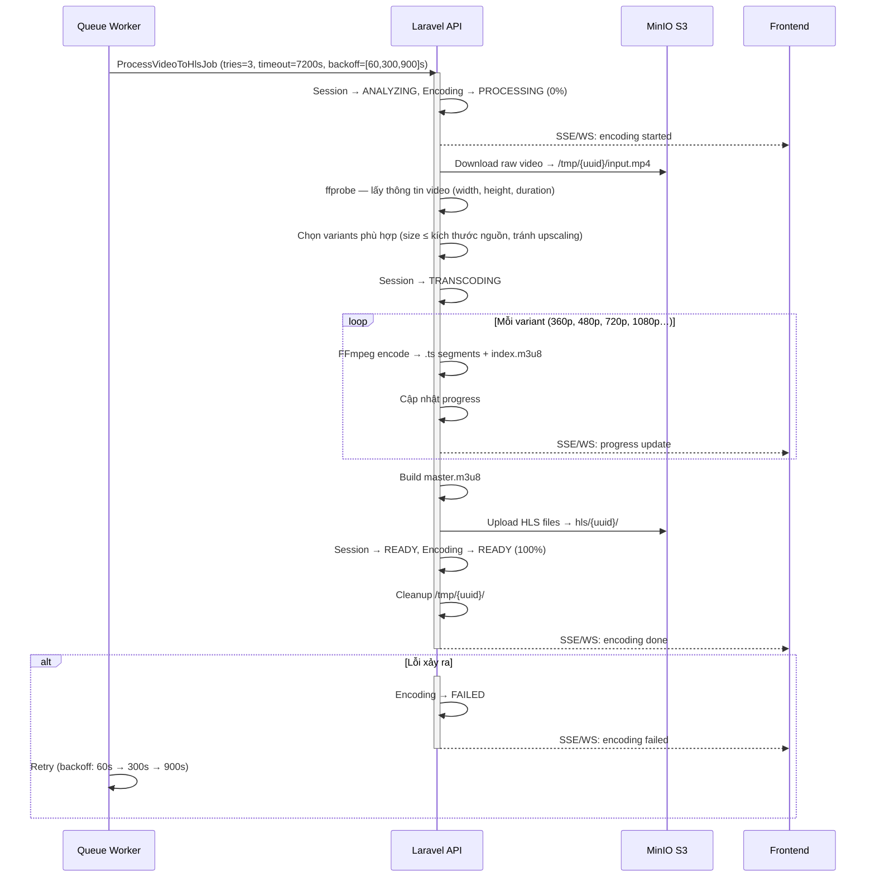

# SD-03b: HLS Encoding — Xử lý video thành HLS

Mô tả luồng queue worker xử lý video raw thành HLS (HTTP Live Streaming) với nhiều variant chất lượng. Đây là phần tiếp nối sau khi SD-03a dispatch `ProcessVideoToHlsJob`.

## Ghi chú

- **Session state progression**: `UPLOADED` → `ANALYZING` (download + probe) → `TRANSCODING` (FFmpeg encode) → `READY`.
- **Không upscale**: Chỉ encode các variant có kích thước **≤** kích thước nguồn. Video 480p sẽ không được encode lên 720p.
- **Retry**: Job thử lại tối đa 3 lần với backoff tăng dần (60s → 300s → 900s).
- **`VideoProcessingService`** và **`FFmpegService`** là internal class của worker — không phải service riêng biệt.
- **SSE/WS progress**: Frontend nhận cập nhật tiến trình real-time qua WebSocket hoặc SSE trong suốt quá trình encode.
