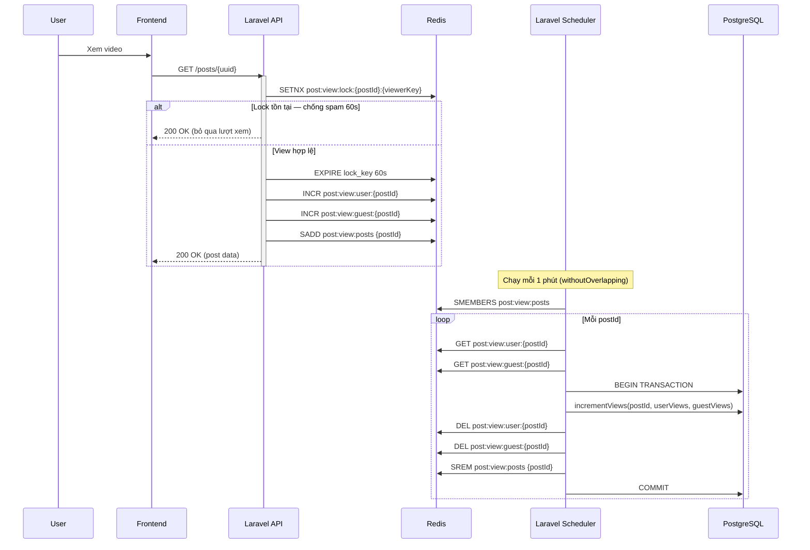

# SD-04: Redis View Count — Đếm lượt xem và đồng bộ về DB

Mô tả luồng đếm lượt xem video dùng Redis làm fast path (không block request), sau đó batch sync về PostgreSQL định kỳ mỗi 1 phút.

## Ghi chú

- **viewerKey**: `user:{userId}` cho người dùng đã đăng nhập; `guest:sha1(ip|userAgent)` cho khách.
- **Anti-spam**: `SETNX` + `EXPIRE 60s` đảm bảo mỗi viewer chỉ được tính 1 lượt/phút cho mỗi video.
- **Tách user/guest**: Hai key riêng (`post:view:user`, `post:view:guest`) để phân tích thống kê theo nhóm.
- **Redis là fast path**: API chỉ ghi vào Redis, không block vì I/O database trong request cycle.
- **Scheduler**: `posts:sync-views` command chạy với `withoutOverlapping()` — không chạy đồng thời nhiều instance.
- Lượt xem được hiển thị theo giá trị Redis (real-time) hoặc DB tùy context, chênh lệch tối đa ~1 phút.
