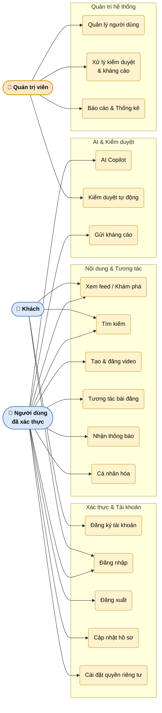

# UC-01: Sơ đồ ca sử dụng tổng quan

Thể hiện toàn bộ các nhóm chức năng của hệ thống Snapi và mối quan hệ giữa ba tác nhân chính. Các ca sử dụng được nhóm thành bốn gói chức năng lớn: Xác thực và tài khoản, Nội dung và tương tác, AI và kiểm duyệt, và Quản trị hệ thống.

> Hình 3.1 — Sơ đồ ca sử dụng tổng quan

## Tác nhân

| Tác nhân | Mô tả |
|----------|-------|
| Khách (Guest) | Người dùng chưa đăng nhập — có thể duyệt và tìm kiếm nhưng không tương tác |
| Người dùng đã xác thực | Đã đăng nhập — đầy đủ quyền tương tác, tạo nội dung và sử dụng AI |
| Quản trị viên | Nhân viên quản lý — kiểm duyệt nội dung, quản lý tài khoản và xem thống kê |

## Ghi chú

- Người dùng đã xác thực kế thừa toàn bộ quyền của Khách.
- Kiểm duyệt tự động (UC13) được kích hoạt bởi hệ thống sau mỗi lần người dùng đăng bình luận hoặc bài đăng, không phải hành động trực tiếp của Admin.
