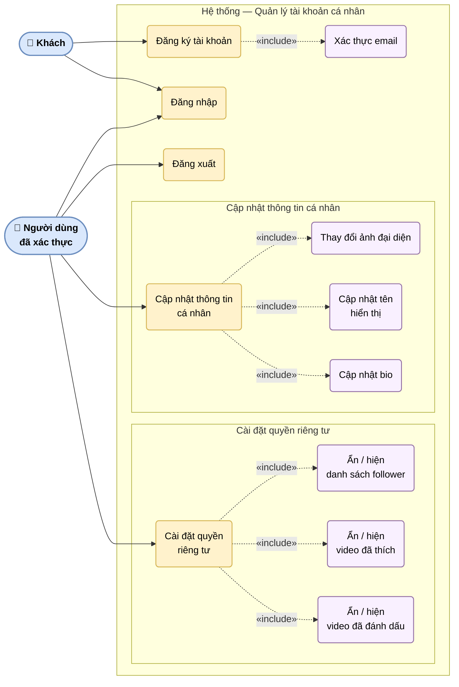

# UC-02: Quản lý tài khoản cá nhân

Mô tả chi tiết các ca sử dụng liên quan đến xác thực và quản lý hồ sơ người dùng, bao gồm đăng ký (kèm xác thực email), đăng nhập, đăng xuất, cập nhật thông tin cá nhân và cài đặt quyền riêng tư.

> Hình 3.2 — Sơ đồ ca sử dụng — Quản lý tài khoản cá nhân

## Ghi chú

- **Đăng ký**: sau khi điền form, hệ thống gửi email xác thực — tài khoản chỉ được kích hoạt sau khi người dùng click link trong email.
- **Cài đặt quyền riêng tư**: mỗi tùy chọn có thể bật/tắt độc lập; thay đổi có hiệu lực ngay lập tức.
- Khách chỉ có thể đăng ký và đăng nhập; tất cả chức năng còn lại yêu cầu xác thực.
