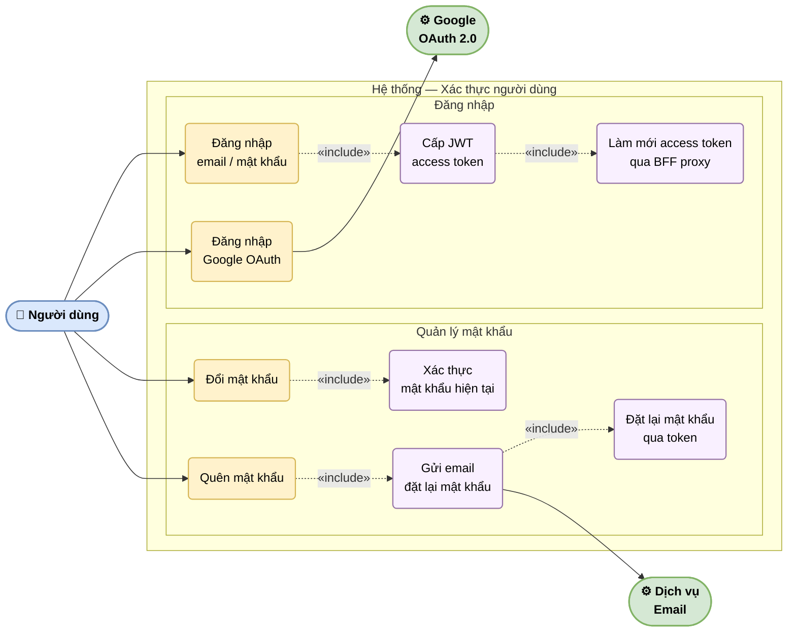

# UC-03: Xác thực người dùng

Mô tả chi tiết luồng đăng nhập qua hai phương thức: email/mật khẩu kết hợp JWT access token + refresh token qua BFF proxy, và Google OAuth. Bao gồm ca sử dụng đổi mật khẩu và quên mật khẩu với luồng email đặt lại.

> Hình 3.3 — Sơ đồ ca sử dụng — Xác thực người dùng

## Ghi chú

- **BFF Proxy**: Next.js App Router đóng vai trò BFF (Backend for Frontend) — refresh token được lưu trong httpOnly cookie, không lộ ra client-side JavaScript.
- **Google OAuth**: luồng redirect qua NextAuth — backend nhận `id_token` từ Google, tạo hoặc map tài khoản nội bộ.
- **Đặt lại mật khẩu**: token trong email có thời hạn ngắn (1 giờ); hết hạn → người dùng phải yêu cầu lại.
