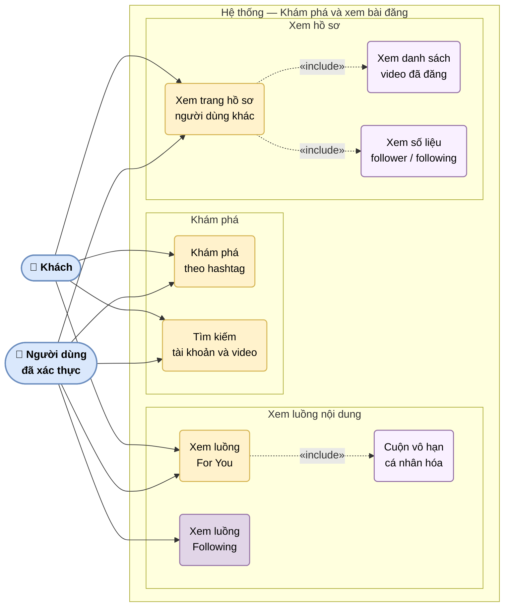

# UC-04: Khám phá và xem bài đăng

Mô tả các ca sử dụng liên quan đến xem và tìm kiếm nội dung. Cả Khách và Người dùng đã xác thực đều có thể thực hiện, nhưng Khách không thể tương tác (thích, bình luận, theo dõi).

> Hình 3.4 — Sơ đồ ca sử dụng — Khám phá và xem bài đăng

## Ghi chú

- **For You** (UC1): Feed cá nhân hóa — khách xem được nhưng feed chưa được cá nhân hóa theo lịch sử xem.
- **Following** (UC2): Chỉ hiển thị khi đã đăng nhập và đang theo dõi ít nhất một người dùng.
- Khách xem được toàn bộ nội dung công khai nhưng **không thể** thích, bình luận, theo dõi hay đánh dấu.
