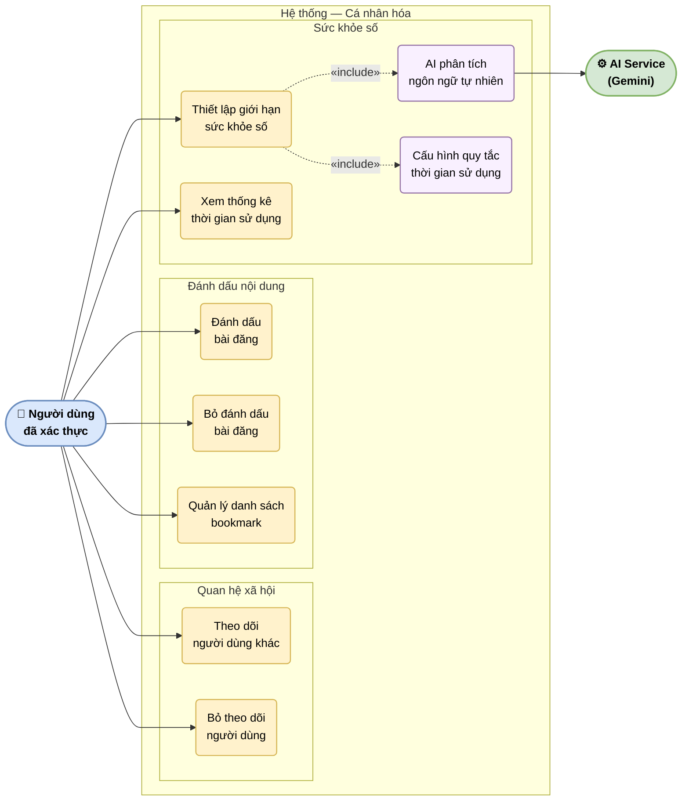

# UC-05: Cá nhân hóa

Mô tả các chức năng giúp người dùng tùy chỉnh trải nghiệm: theo dõi/bỏ theo dõi, đánh dấu bài đăng, quản lý bookmark, thiết lập giới hạn sức khỏe số qua AI phân tích ngôn ngữ tự nhiên, và xem thống kê thời gian sử dụng.

> Hình 3.5 — Sơ đồ ca sử dụng — Cá nhân hóa

## Ghi chú

- **Thiết lập giới hạn sức khỏe số**: người dùng mô tả mục tiêu bằng ngôn ngữ tự nhiên (ví dụ: "Nhắc tôi nghỉ sau 2 giờ dùng mỗi ngày") — AI phân tích và chuyển thành quy tắc cấu trúc.
- **Thống kê thời gian** (UC7): tổng hợp từ `screen_time_sessions` — hiển thị theo ngày/tuần với biểu đồ sử dụng.
- Bookmark được ẩn riêng tư theo mặc định; người dùng có thể chuyển sang công khai trong cài đặt quyền riêng tư.
