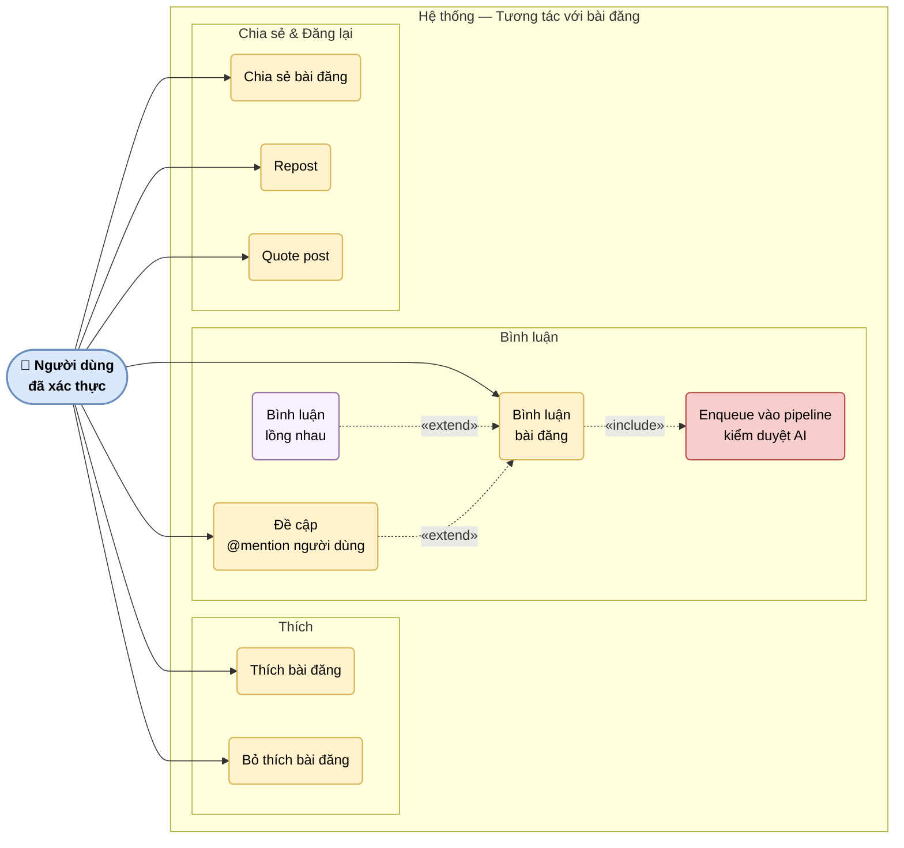

# UC-06: Tương tác với bài đăng

Mô tả các ca sử dụng liên quan đến tương tác xã hội: thích, bình luận (bao gồm lồng nhau), chia sẻ, repost, quote post và @mention. Sau khi người dùng bình luận, hệ thống tự động enqueue vào pipeline kiểm duyệt AI qua Kafka.

> Hình 3.6 — Sơ đồ ca sử dụng — Tương tác với bài đăng

## Ghi chú

- **Pipeline kiểm duyệt AI** (UC3B): sau khi bình luận được lưu thành công, Laravel queue worker tự động gửi message vào Kafka topic `moderation.request.v1` — không đồng bộ, không chặn response trả về client.
- **Bình luận lồng nhau** (UC3A): người dùng reply vào một bình luận; mỗi reply cũng bị enqueue kiểm duyệt độc lập.
- **@mention** (UC4): hoạt động trong cả bình luận và nội dung bài đăng; người được mention nhận thông báo.
- **Quote post** (UC7): tạo bài đăng mới embed bài gốc kèm bình luận của người đăng lại.
