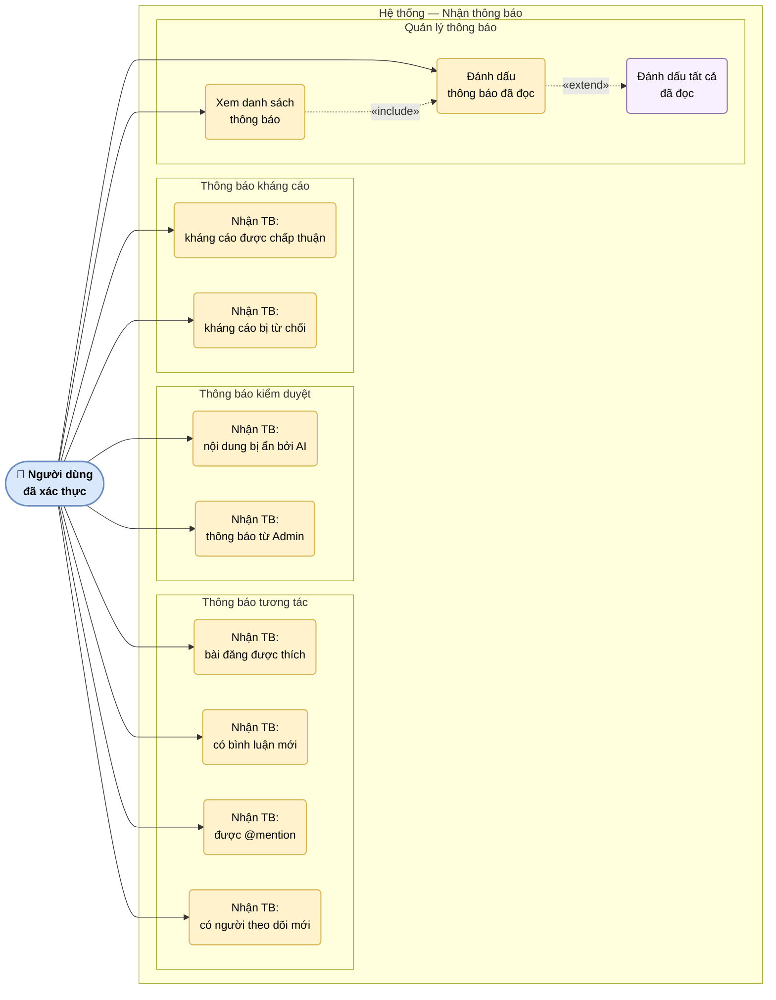

# UC-07: Nhận thông báo

Mô tả hệ thống thông báo: nhận thông báo tương tác, kiểm duyệt, kết quả kháng cáo và đánh dấu đã đọc. Thông báo được phân nhóm theo nguồn kích hoạt.

> Hình 3.7 — Sơ đồ ca sử dụng — Nhận thông báo

## Ghi chú

- Thông báo tương tác được tạo bởi **Laravel Events** khi có hành động xã hội xảy ra (like, comment, follow, mention).
- Thông báo kiểm duyệt được tạo khi AI worker ghi kết quả `violation = true` vào `AiModerationReport`, hoặc khi Admin thực hiện hành động thủ công.
- Thông báo kháng cáo được tạo khi Admin cập nhật trạng thái `appeal`.
