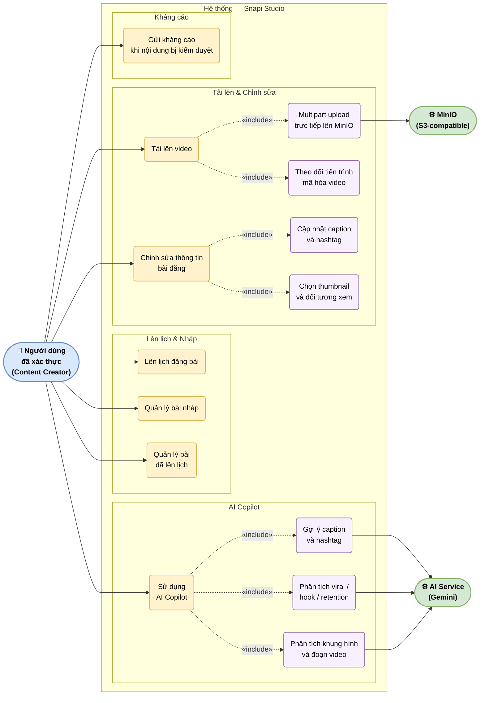

# UC-08: Quản lý bài đăng — Snapi Studio

Mô tả các chức năng trong Snapi Studio dành cho người tạo nội dung: tải lên video (multipart upload trực tiếp lên MinIO), chỉnh sửa bài đăng, lên lịch, quản lý nháp, sử dụng AI Copilot và gửi kháng cáo.

> Hình 3.8 — Sơ đồ ca sử dụng — Quản lý bài đăng (Snapi Studio)

## Ghi chú

- **Multipart upload** (UC1A): client chia video thành các part, upload trực tiếp lên MinIO — backend chỉ khởi tạo và hoàn thành session, không trung gian luồng dữ liệu.
- **Mã hóa video** (UC1B): sau khi upload xong, backend enqueue job mã hóa; trạng thái theo dõi qua `VideoEncoding` model.
- **AI Copilot** (UC6): giao tiếp qua SSE stream — kết quả được trả dần về UI trong thời gian thực.
- **Kháng cáo** (UC7): chỉ khả dụng khi bài đăng có trạng thái bị kiểm duyệt (`is_hidden = true`).
