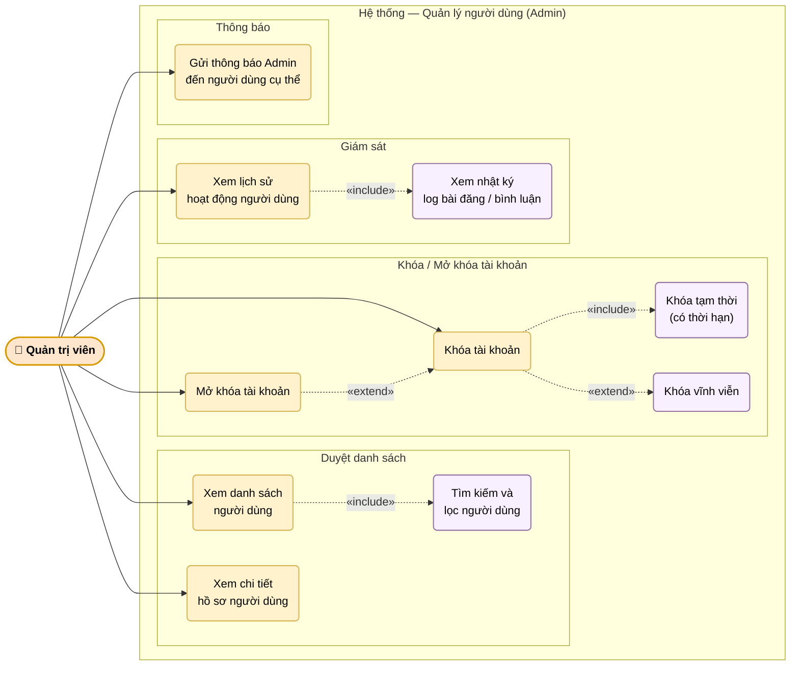

# UC-09: Quản lý người dùng hệ thống (Admin)

Mô tả các chức năng của Quản trị viên trong việc quản lý tài khoản người dùng: xem danh sách, khóa/mở khóa với thời hạn tùy chỉnh, xem lịch sử hoạt động và gửi thông báo trực tiếp.

> Hình 3.9 — Sơ đồ ca sử dụng — Quản lý người dùng hệ thống

## Ghi chú

- **Khóa tạm thời** (UC3A): admin chọn thời hạn (ví dụ: 7 ngày, 30 ngày) — hệ thống tự động mở khóa khi hết hạn.
- **Khóa vĩnh viễn** (UC3B): extend của UC3 — yêu cầu xác nhận thêm và lý do ghi vào `AdminLog`.
- **Mở khóa** (UC4): chỉ áp dụng khi tài khoản đang bị khóa tạm thời hoặc vĩnh viễn; extend quan hệ với UC3.
- Mọi hành động khóa/mở khóa đều được ghi vào `admin_logs` kèm lý do.
