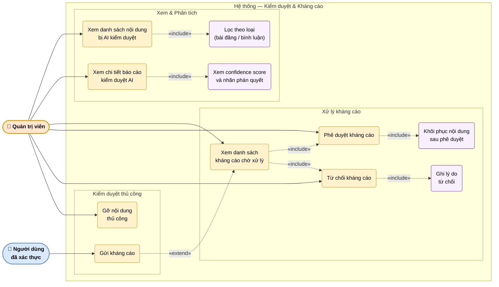

# UC-10: Kiểm duyệt và kháng cáo (Admin)

Mô tả quy trình xử lý nội dung vi phạm từ phía quản trị viên: xem danh sách bị AI kiểm duyệt, xem chi tiết báo cáo (confidence score, nhãn), xử lý kháng cáo (phê duyệt/từ chối), khôi phục nội dung và gỡ thủ công. Phía người dùng: gửi kháng cáo.

> Hình 3.10 — Sơ đồ ca sử dụng — Kiểm duyệt và kháng cáo

## Ghi chú

- **Confidence score** (UC2A): giá trị từ 0–1 do mô hình PhoBERT xuất ra; ngưỡng vi phạm mặc định là 0.8 (cấu hình trong `.env`).
- **Khôi phục nội dung** (UC4A): khi admin phê duyệt kháng cáo, `is_hidden` trên bài đăng/bình luận chuyển về `false` và người dùng nhận thông báo.
- **Gửi kháng cáo** (UC7): người dùng chỉ có thể gửi kháng cáo khi nội dung có trạng thái bị ẩn; mỗi nội dung chỉ có một kháng cáo đang xử lý tại một thời điểm.
