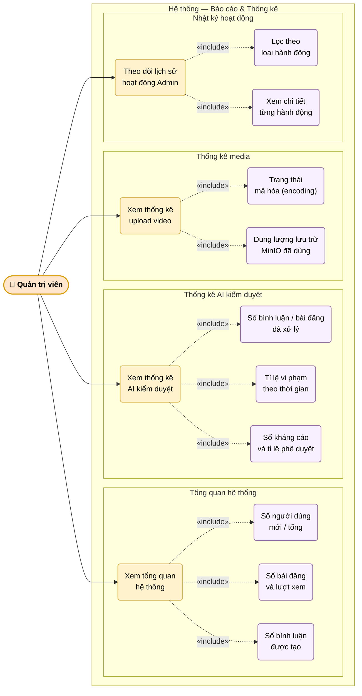

# UC-11: Xem báo cáo và thống kê (Admin)

Mô tả các chức năng giám sát hệ thống dành cho quản trị viên: tổng quan hệ thống, thống kê AI kiểm duyệt, thống kê upload/encoding video và theo dõi lịch sử hoạt động admin.

> Hình 3.11 — Sơ đồ ca sử dụng — Xem báo cáo và thống kê

## Ghi chú

- Dữ liệu tổng quan được tổng hợp từ các bảng: `users`, `posts`, `comments`, `activity_logs`.
- Thống kê AI lấy từ `ai_moderation_reports` và `appeals` — có thể lọc theo khoảng thời gian.
- **Nhật ký Admin** (UC4): ghi lại mọi hành động quan trọng (khóa user, xóa bài, xử lý kháng cáo) vào bảng `admin_logs` để audit trail.
